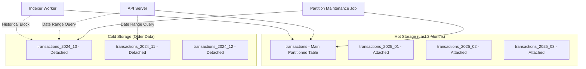

# Hot/Cold Storage Implementation Pla

n

## Overview

Implement PostgreSQL native range partitioning for the `transactions` table to separate hot (last 3 months) and cold (older) data. This reduces query workload for common API calls while maintaining access to historical data when explicitly requested via date ranges. The solution includes on-demand partition creation to support historical indexing of old blocks.

## Architecture




## Implementation Steps

### 1. Database Schema Migration

**File**: `server/migrations/046-transactions-hot-cold-partitioning.sql`

- Convert `transactions` table to a partitioned table using PostgreSQL native range partitioning by `timestamp`

- Create initial partitions for the last 3 months (monthly partitions) as **attached** partitions

- Create a function to automatically create new monthly partitions

- Create a function to detach and archive old partitions to cold storage tables

- Create a function to create partitions on-demand (for historical indexing)

- Add metadata table `partition_metadata` to track hot vs cold partitions

- Create indexes on cold tables (mirror hot table indexes)

**Key SQL Operations**:

- `ALTER TABLE transactions` to partitioned table

- Create monthly partitions with `FOR VALUES FROM ... TO ...`

- Function `create_monthly_partition(month_start DATE, attach BOOLEAN)` for auto-creation

- If `attach=true`: Creates as attached hot partition

- If `attach=false`: Creates as detached cold table

- Function `archive_old_partition(partition_name TEXT)` to detach and rename

- Function `ensure_partition_for_timestamp(timestamp TIMESTAMP)` for on-demand creation

### 2. Transaction Service Updates

**File**: `server/services/transactionService.js`

Modify `getTransactionsWithFilters()` method:

- **Default behavior (no date range)**: Query only the main `transactions` table (hot partitions)

- **Date range queries**: 

- Determine if date range includes cold data (older than 3 months)

- If yes, query both hot (main table) and cold (separate tables) and union results

- Use `UNION ALL` with proper ordering and pagination

- Add helper method `getColdPartitionsForDateRange(startDate, endDate)` to identify which cold tables to query

- Add helper method `buildColdTableQuery(tableName, conditions, values)` to build queries for cold tables

**Query Strategy**:

```sql
-- Default (hot only)
SELECT ... FROM transactions WHERE ... ORDER BY timestamp DESC

-- With date range including cold
(SELECT ... FROM transactions WHERE ... AND timestamp >= hot_start)
UNION ALL
(SELECT ... FROM transactions_2024_10 WHERE ... AND timestamp < hot_start)
ORDER BY timestamp DESC
```


### 3. Partition Maintenance Service

**File**: `server/services/partitionMaintenanceService.js` (new)

Create a service to:

- Automatically create new monthly partitions (run monthly, before month starts)

- Archive partitions older than 3 months (detach from main table, rename to cold storage naming)

- **Create partitions on-demand for historical indexing** (when indexer hits missing partition)

- Update `partition_metadata` table

- Handle partition creation errors gracefully
- Log partition operations for monitoring

**Key Methods**:

- `ensureMonthlyPartitions()` - Create partitions for next 3 months if missing

- `ensurePartitionForTimestamp(timestamp)` - **Create partition on-demand for a specific timestamp**

- Determines if timestamp is hot (within 3 months) or cold (older)

- Creates as attached partition if hot, detached cold table if cold

- Handles both historical indexing and future data

- Returns partition name for verification

- `archiveOldPartitions()` - Detach and archive partitions older than 3 months

- `getPartitionMetadata()` - Query current partition status

- `getColdPartitionsForDateRange(startDate, endDate)` - List cold tables needed for date range queries

### 4. Indexer Compatibility & Historical Indexing

**File**: `server/services/indexer/db.js`

**Critical Update**: Modify `saveTransaction()` to handle missing partitions for historical indexing:

**Current Behavior**:

- PostgreSQL automatically routes inserts to the correct partition based on `timestamp`

- If partition doesn't exist, INSERT fails with error: "no partition of relation 'transactions' found for row"

**Historical Indexing Challenge**:

- Historical sync processes blocks from old timestamps (potentially years ago)

- If indexing old blocks, the partition for that time period may not exist (if it's been archived to cold storage)

- Need to handle missing partition errors gracefully

**Solution Implementation**:

```javascript
async function saveTransaction(tx) {
  await connectClients();
  
  try {
    // Extract addresses and block_height (existing code)
    // ... existing address extraction logic ...
    
    // Primary insert - PostgreSQL routes to correct partition
    await pgPool.query(
      `INSERT INTO transactions (...) VALUES (...) ON CONFLICT ...`,
      values
    );
  } catch (error) {
    // Handle missing partition error for historical indexing
    if (error.message && error.message.includes('no partition of relation')) {
      console.log(`[Indexer] Partition missing for timestamp ${tx.timestamp}, creating on-demand...`);
      
      try {
        // Create partition on-demand
        const partitionService = require('../../partitionMaintenanceService');
        const partitionName = await partitionService.ensurePartitionForTimestamp(tx.timestamp);
        console.log(`[Indexer] Created partition ${partitionName} for historical indexing`);
        
        // Retry insert after partition creation
        await pgPool.query(
          `INSERT INTO transactions (...) VALUES (...) ON CONFLICT ...`,
          values
        );
      } catch (partitionError) {
        console.error(`[Indexer] Failed to create partition for timestamp ${tx.timestamp}:`, partitionError.message);
        throw partitionError;
      }
    } else {
      // Re-throw other errors
      throw error;
    }
  }
}
```


**Verification**:

- Test historical indexing with old blocks (simulate processing 2-year-old blocks)

- Verify partitions are created on-demand as detached cold tables

- Verify `ON CONFLICT` handling works correctly with partitioned tables

- Monitor partition creation logs during historical indexing

### 5. Maintenance Job/Cron

**File**: `server/scripts/maintain_partitions.js` (new)

Standalone script to run partition maintenance:

- Can be run as cron job (daily or weekly)

- Creates upcoming partitions

- Archives old partitions

- Reports partition status

**Integration Options**:

- Run via cron: `0 2 * * *` (daily at 2 AM)

- Or integrate into existing job system in `server/api-server.js`

### 6. Migration Strategy for Existing Data

**File**: `server/migrations/046-transactions-hot-cold-partitioning.sql`

Handle existing data with full partition coverage:

**Migration Steps**:

1. **Analyze existing data** to determine date range (find MIN/MAX timestamp)

2. Create new partitioned table `transactions_new`

3. **Create partitions for ALL months in existing data**:

- For each month with data, create a partition

- **Partitions older than 3 months**: create as **detached cold tables** immediately

- **Partitions within last 3 months**: create as **attached hot partitions**

4. Copy data in batches by timestamp ranges (use `COPY` for performance)

- Copy directly into appropriate partitions (hot or cold)

5. Verify row counts match for each partition

6. Rename `transactions` → `transactions_old`, `transactions_new` → `transactions`

7. Drop `transactions_old` after verification period (7 days)

**Why Create All Partitions During Migration**:

- Ensures historical indexing doesn't hit missing partitions for existing data

- Cold partitions are created but detached (not attached to main table)

- This way, historical indexing can write to old partitions without them being in the hot query path

- Prevents on-demand creation overhead for bulk historical data

**Migration SQL Pattern**:

```sql
-- Find date range
SELECT MIN(timestamp) as min_ts, MAX(timestamp) as max_ts FROM transactions;

-- For each month in range:
-- If month is older than 3 months: CREATE TABLE transactions_YYYY_MM (...) (detached)
-- If month is within 3 months: CREATE TABLE transactions_YYYY_MM PARTITION OF transactions_new FOR VALUES FROM ... TO ... (attached)

-- Copy data in batches
COPY transactions_YYYY_MM FROM ... WHERE timestamp >= ... AND timestamp < ...;
```


### 7. API Documentation Updates

**File**: `server/TRANSACTIONS_API.md`Document:

- Performance characteristics (hot vs cold queries)

- Date range behavior (automatic cold storage access)

- Query latency expectations
- Historical indexing compatibility

### 8. Monitoring and Health Checks

**File**: `server/services/partitionMaintenanceService.js`

Add health check methods:

- `checkPartitionHealth()` - Verify partition structure is correct

- `getPartitionStats()` - Report partition sizes, row counts

- `getOnDemandPartitionStats()` - Track partitions created on-demand (for monitoring historical indexing activity)

- Alert if partitions are missing or incorrectly configured

**Integration**: Add to existing health endpoint in `server/api-server.js`

## Configuration

**Environment Variables** (add to `.env`):

- `HOT_STORAGE_MONTHS=3` - Number of months to keep in hot storage

- `PARTITION_MAINTENANCE_ENABLED=true` - Enable automatic partition maintenance

- `PARTITION_ARCHIVE_THRESHOLD_DAYS=90` - Days before archiving (3 months)

- `PARTITION_ON_DEMAND_ENABLED=true` - Enable on-demand partition creation for historical indexing

## Testing Strategy

1. **Unit Tests**: Test partition creation, archiving logic, on-demand creation

2. **Integration Tests**: 

- Verify indexer writes go to correct partitions

- **Test historical indexing with old blocks** (simulate processing 2-year-old blocks)

- Verify on-demand partition creation during historical indexing

- Test API queries with and without date ranges

- Test union queries across hot/cold boundaries
- Test gap filling with old blocks

3. **Performance Tests**: 

- Measure query latency improvement for hot-only queries

- Verify cold queries still perform acceptably

- Measure on-demand partition creation overhead

4. **Migration Tests**: Test data migration on staging with production-like data volume

## Rollback Plan

- Keep `transactions_old` table for 7 days after migration

- If issues arise, can quickly swap back: `transactions` → `transactions_partitioned`, `transactions_old` → `transactions`

- Partition maintenance can be disabled via env var without breaking existing functionality

- On-demand partition creation can be disabled (will fail gracefully with clear error message)

## How Historical Indexing Works

**Scenario 1: Indexing Current/Recent Blocks**

- Indexer writes transaction with current timestamp

- PostgreSQL routes to hot partition (attached)

- Query performance: Fast (hot partition)

**Scenario 2: Indexing Old Blocks (Historical Sync)**

- Indexer writes transaction with old timestamp (e.g., 2 years ago)

- PostgreSQL tries to route to partition → Partition doesn't exist

- `saveTransaction()` catches "no partition" error

- Calls `partitionMaintenanceService.ensurePartitionForTimestamp()`

- Service creates partition as **detached cold table** (not attached to main table)

- Retry INSERT → Success

- Query performance: Hot queries unaffected (cold table is detached)

**Scenario 3: Querying Historical Data**

- API receives date range query including old data

- `transactionService` identifies cold tables needed for date range

- Queries cold tables directly (UNION with hot partitions)

- Returns combined results

## Future Considerations

- Consider partitioning `blocks` table similarly (if it grows large)

- Consider partitioning event tables (`claim_settlements`, `proof_events`, etc.) if they become large

- Evaluate moving cold tables to separate PostgreSQL instance or read replicas for further cost optimization